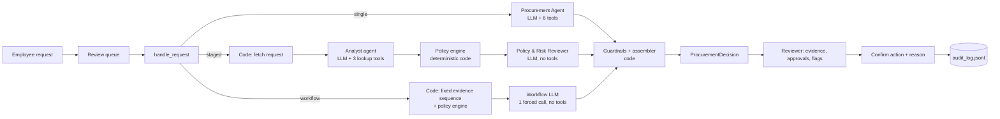
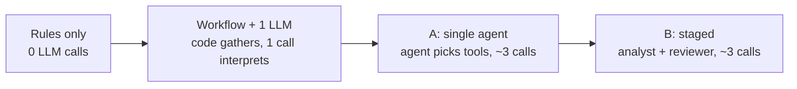

# AI Procurement Request Copilot (FDE Assessment 3)

## 1. What it does

A reviewer opens a software purchase request; the copilot gathers evidence (budget, existing catalog, vendor registry and vendor-risk service, policy) and recommends the next action with the approvals required, risk flags, missing information and a cited evidence trail.
Deterministic code computes every threshold, budget check, review date, conflict and Security/Privacy/Legal trigger; the LLM judges overlap with existing tools, reads intent from free text and writes the recommendation.
A human confirms every action (with a reason when overriding the copilot), and each decision is written to an audit log. Nothing is ever approved or purchased automatically.

## 2. Setup and run

Requires Python 3.11 or 3.12 (tested on 3.12.15, macOS).

```bash
python -m venv .venv
source .venv/bin/activate            # Windows: .\.venv\Scripts\Activate.ps1
python -m pip install -r requirements.txt
cp .env.example .env                 # Windows: Copy-Item .env.example .env ; then add GEMINI_API_KEY (or LLM_PROVIDER=groq + GROQ_API_KEY)
python verify_setup.py               # pre-flight: PRE-FLIGHT PASSED
python run_local.py                  # ONE command: mock vendor-risk API :8001 + reviewer UI (Streamlit) http://127.0.0.1:8501
```

Without an API key the app still works: every request gets the rule-based result with an "AI analysis unavailable" banner.

Other commands:

```bash
python -m unittest discover -s tests -v          # unit tests (no network)
python scripts/smoke_llm.py                      # provider/model check + forced tool-call round trip
python scripts/run_one.py REQ-1008 --arch single # one request: decision, raw proposal, guardrail events
python evals/run_all.py --trials 3 --resume      # public runner + 23 main + 6 held-out cases: workflow, single, staged + rules-only
python evals/run_all.py --no-llm                 # rules-only baseline (no key needed); writes runtime/eval_scratch/ unless --save
```

### Tracing

- **Local trace, always on.** Every run stores its tool calls, guardrail events, per-call LLM log (`llm_log`) and the steps derived from them (`steps`: who acted, why, tools, LLM calls, tokens, time) in `runtime/traces/`. The reviewer UI shows them under **How this was decided**, followed by the guardrail corrections and the AI proposal next to the final result. Eval run files keep the same trace.
- **LangSmith, optional and off by default.** It is used only for tracing; no agent framework is involved. To turn it on, run `python -m pip install -r requirements.txt` and set these in `.env`:

  ```
  LANGSMITH_TRACING=true
  LANGSMITH_API_KEY=<your key>
  LANGSMITH_PROJECT=procurement-copilot
  LANGSMITH_ENDPOINT=https://api.smith.langchain.com
  ```

  Each request becomes one trace: `handle_request` (metadata: request, architecture, mode, provider, model, case ID in evals), then a span per stage (`single`, `analyst`, `reviewer`, `workflow`) containing its LLM calls, plus `policy_engine.evaluate`, `guardrails.assemble` and one span per tool. Without the key, or with `LANGSMITH_TRACING` unset or false, nothing is imported or sent. The unit tests force it off, and the eval trials ran with it off.
- **Demo traces** (about 21 LLM calls):

  ```bash
  python scripts/run_one.py REQ-1006 --arch single     # also --arch staged, --arch workflow
  python scripts/run_one.py REQ-1008 --arch single     # also --arch staged, --arch workflow
  python scripts/run_one.py REQ-X111 --fixtures --arch single   # --fixtures sets EXTRA_DATA_DIR=evals/fixtures
  ```

  Screenshots: _(to be added: staged trace for REQ-1008; workflow trace for REQ-X111)_. Shared trace link: _(to be added)_.

## 3. Product workflow

```
Employee submits request (form, or data/requests.json)
  -> Reviewer opens it from the queue (status: New / Analysed / Action recorded)
  -> Copilot gathers evidence and runs deterministic checks
  -> Reviewer sees, decision first: banners for anything unverified/conflicting/injected, the recommendation
     and next step, approvals grouped into business approvals and specialist reviews (each with its rule
     and policy section), risk flags by severity, missing / could-not-verify, an evidence table filterable
     by Rule/Tool/AI, run cost (LLM calls, tool calls, latency), and "How this was decided" (who acted,
     with which tools, guardrail corrections, AI proposal vs final result)
  -> Reviewer chooses: Send for approvals | Request clarification | Suggest existing tool | Hold for manual review
     The confirmation states the consequence; a reason is required when overriding the copilot
  -> runtime/audit_log.jsonl: time, request, run ID, architecture, copilot decision, action, override, reason
```

The reviewer UI is the Streamlit app from the starter pack (`app.py`), extended to the full workflow. Routing is simulated: actions are recorded in the audit log only. The queue can be searched and filtered by status, each request has a direct link (`http://127.0.0.1:8501/?request=REQ-1007`), the latest analysis of each request survives a restart, and the layout works at phone width. The reviewer can pick the configuration (workflow + 1 LLM, single agent, staged) or run all three side by side on one request. Light and dark themes: top-right menu → Settings → Theme (or follow the system setting).

## 4. Architecture



Four configurations, one rung apart on the Class 12 ladder:



| | Workflow + 1 LLM | A: single agent | B: staged (2 agents) |
|---|---|---|---|
| LLM roles | one forced call, no tools | one agent with all 6 tools | Analyst (3 lookup tools; code fetches the request) → Policy & Risk Reviewer (no tools) |
| Policy engine | called by code before the LLM | a tool the agent calls (code runs it if skipped) | called by code between the stages |
| Handoff | none | none | `EvidencePack` (evidence, implied data classes with quotes, gaps, unsupported claims) + the raw tool results + the policy-engine result; the reviewer records its disagreements |
| Idea being tested | the evidence path is fixed, so the AI only needs to interpret | simplest agent | an independent reviewer that checks the analyst against raw tool results improves grounding and judgement |

**Rules only** is the same code with no LLM (also the fallback path). All end in the same code: completeness gate → policy engine → guardrails → `ProcurementDecision` (`src/solution.py::handle_request`; `workflow` is reachable through `handle_request_with_trace` and the eval runners, the contract is unchanged). Why a workflow rung, why sequential stages and not a supervisor, and what would change the decision: [`docs/architecture.md`, Design rationale](docs/architecture.md#design-rationale-classes-12-and-13). Any LLM failure falls back to the rule-based result with the flag `llm_unavailable`. More detail, including every deviation from the spec: [`docs/architecture.md`](docs/architecture.md).

## 5. Tools and agents

| Tool | Type | What it returns |
|---|---|---|
| `get_request_details` | deterministic | normalised request, requester and reporting line, required-field check, injection scan |
| `check_budget` | deterministic | cost vs the department's available software budget |
| `search_software_catalog` | deterministic | existing licensed products in the same category/vendor/product, purchase history, which raise the overlap flag |
| `get_vendor_status` | deterministic logic over an **external** service (mock vendor-risk API) | registry row + API outcome (ok / not found / unavailable, one retry), review age vs the policy reference date, expiry, conflict, new vendor, legal terms |
| `evaluate_policy_rules` | deterministic, **authoritative** | approvals with reasons, flags, missing information, tier, data classes |
| `lookup_policy_section` | deterministic | exact text of one policy section |

| Decided by | What |
|---|---|
| Code | financial tier, budget, review currency (365 days), registry/API conflict, Security/Privacy/Legal triggers, required fields, injection scan, final merge |
| LLM | does an existing tool already meet the need; data classes implied only by free text, each with a verbatim quote (code then applies Security/Privacy/Legal; the LLM cannot add or remove a role itself); recommendation and next-step wording |
| Human | every routing action, approval and exception |

Guardrails (`src/guardrails.py`): code-computed approvals and flags are always kept; an AI-implied data class counts only if its quote appears word for word in the request's own text, and then the policy engine re-runs with it; a specialist review the AI proposes without such a class becomes a question for the reviewer; any other AI-proposed role is dropped; LLM evidence is kept only if its source tool ran, every number, date and ID in it appears in the tool results, and it does not contradict the code's budget check; wording that claims approval or purchase is replaced by a template; `human_review_required` is always true.

Prompt injection: request text, vendor notes and API text reach the LLM only inside tool results marked as untrusted data, a deterministic scanner flags embedded instructions independently of the LLM, and the UI renders all business text as plain text (Markdown-escaped, never HTML; tested with link, image, formula and `` payloads).

## 6. Assumptions

1. **Annual amount** = `annual_cost_usd` as given. One-time costs are treated as the annual amount.
2. **`requested_integrations: []` means "none"**. `null` or an absent key means missing.
3. **Missing data access**: `data_access_level` of `null`, `""` or `"unknown"` counts as missing.
4. **New vendor** = registry `procurement_status == "New"`, or a vendor absent from the registry.
5. **Standard legal terms** = registry `legal_terms_status == "Approved"`. Anything else (Draft, Unknown, blank, not registered) triggers Legal.
6. **Review currency**: a security review is current if `0 ≤ (reference_date − review_date) ≤ 365 days`. The reference date (2026-09-30) is parsed from `data/procurement_policy.md`; the machine clock is never used.
7. **Conflict**: the registry and the API disagree when one says approved and the other does not (expired, not_completed, pending), or when both say approved with different review dates. A conflict is surfaced and routed to Security; neither source wins silently.
8. **Cross-region**: vendor stores data outside the region **and** the request involves PII or confidential documents → material cross-region issue → Privacy and Legal.
9. **Unknown data residency**: vendor-risk API unavailable and the request involves PII or confidential documents → treated as possibly out of region → Privacy.
10. **SSO is not a PII integration.** HR/HRIS/payroll → employee PII; CRM/helpdesk → customer PII; Git/repositories → source code; production/cloud/infrastructure → production access.
11. **Overlap flag**: raised when a catalog product has the same category or an identical product name. Whether it actually *meets the need* is the AI's judgement and drives "use existing tool". Same-vendor-only matches are evidence, not a flag.
12. **Cost missing**: the tier cannot be determined, so the only required approval is Procurement (triage owner) until cost is provided.
13. **Vendor-risk API unavailable, registry review current, data not sensitive**: flag `vendor_risk_unavailable` but do not add Security (the gap is not material). Otherwise an unavailable API adds Security.
14. **Department Head** is shown as a role; the named person is a hint only (the Director of the requester's department, else the nearest Director/VP up the reporting line). Sales and Customer Success report to the Go To Market Director, who has no budget row.

## 7. Evaluation

**Method.** One command runs both harnesses (`python evals/run_all.py`; details in [`evals/README.md`](evals/README.md)):

- **Public runner**: the starter pack's 6 cases and minimum checks, unchanged except that it now starts the mock API itself.
- **Main set**: 23 hand-labelled cases in [`evals/golden_cases.json`](evals/golden_cases.json):
  - the 10 official requests,
  - 11 eval-only fixtures (threshold boundaries, vendor-name casing, an unregistered vendor, injection in the product name and in vendor-API notes, an HR integration, an unknown requester, PII implied only by text),
  - 2 fault injections (vendor-risk API down, LLM unavailable).
- **Held-out set**: 6 cases in [`evals/golden_heldout.json`](evals/golden_heldout.json), committed with the decision rule (`d4e31d7`) before any round-2 code, and never edited. It is reported in its own table, never merged with the main set.
- **Scoring**: exact sets, so over-escalation fails too. A case passes only if approvals, flags, missing information, decision and safety are all right. Raw-agent metrics score the AI proposal before guardrails, and the trace counts every correction code made.
- **Four configurations** on the same cases: rules only (the baseline; G-08, G-23, H-01, H-03, H-05 and H-06 need the AI by design), workflow + 1 LLM, single agent (A), staged (B).
- **Decision rule**, pre-registered in [`IMPROVEMENTS.md`](IMPROVEMENTS.md) §3 and applied by [`evals/decision_rule.py`](evals/decision_rule.py): safety gate, then quality within one case of the best on both sets, then the fewest LLM calls.
- **Manual review**: 6 runs per AI configuration ([`evals/results/manual_review.md`](evals/results/manual_review.md)). AI-assisted pre-fill; not quoted here until the author has confirmed it run by run.

**How run 3 was run.** The code was frozen at tag `run3-frozen` (`b1bceb3`), and every trial ran from a separate git worktree at that tag (`git worktree add ../a3-run3 run3-frozen`) with tracing off, so nothing built on `main` during the trials (the "How this was decided" view, optional tracing, scoring reports) could affect them. 3 trials, gemini-3.5-flash-lite, temperature 0, one API key. Trials 1 and 2 ran on 9 October; trial 3 hit the free tier's 500-requests-per-day limit and was finished with `--resume` after the daily reset on 10 October, with the same key, code and settings. All 348 runs are valid (none excluded for quota). The results were copied back in one commit (`da684a1`); the summary was then rebuilt from the same run files with a reporting fix (held-out reviewer row) and no score changed.

**Results, main set** ([`evals/results/summary.md`](evals/results/summary.md), which also has the per-case matrix and every failure with its reason):

| Metric | Rules only | Workflow + 1 LLM | Single (A) | Staged (B) |
|---|---:|---:|---:|---:|
| Mean passes per trial (of 23) | 21.00 (21, 21, 21) | 22.00 (22, 22, 22) | 23.00 (23, 23, 23) | 20.67 (22, 21, 19) |
| Cases only the AI can get right (G-08, G-23) | 0/6 | 3/6 | 6/6 | 2/6 |
| Raw agent decision accuracy | n/a | 60/66 | 64/66 | 60/66 |
| Code corrections per run (approvals + flags restored) | n/a | 0.09 | 0.06 | 0.30 |
| Ungrounded evidence items removed (total) | n/a | 18 | 7 | 1 |
| Implied data classes accepted / rejected (C3, total) | n/a | 10 / 10 | 21 / 4 | 20 / 12 |
| Injection cases passed (3 per trial) | 9/9 | 9/9 | 9/9 | 9/9 |
| Fault cases passed (2 per trial) | 6/6 | 6/6 | 6/6 | 5/6 |
| Avg active latency (ms) | 51 | 2957 | 8112 | 8309 |
| Avg total latency incl. rate-limit waits (ms) | 51 | 5840 | 20654 | 18614 |
| Avg LLM calls / run | 0.00 | 0.96 | 3.25 | 3.00 |
| Avg tokens / run | 0 | 3832 | 11291 | 10136 |
| Decision consistency across trials | 23/23 | 23/23 | 23/23 | 20/23 |
| Public runner minimum checks | 6/6 | 6/6 | 6/6 | 6/6 |

**Results, held-out set**:

| Metric | Rules only | Workflow + 1 LLM | Single (A) | Staged (B) |
|---|---:|---:|---:|---:|
| Mean passes per trial (of 6) | 2.00 (2, 2, 2) | 4.00 (4, 5, 3) | 4.33 (5, 4, 4) | 4.33 (4, 5, 4) |
| AI-only cases (H-01, H-03, H-05, H-06) | 0/12 | 6/12 | 8/12 | 7/12 |
| Rules-solvable cases incl. negative control (H-02, H-04) | 6/6 | 6/6 | 5/6 | 6/6 |
| Held-out injection case (H-05, paraphrased) | 0/3 | 3/3 | 3/3 | 3/3 |

**Run history.** Run 2 (archived in [`evals/results/history/run2/`](evals/results/history/run2/summary.md): single 22/23, staged 20/23, rules only 21/23, 1 trial) was completed in two sessions because the free tier allows 500 requests per day per project. Both sessions used the same code, model and settings: `--resume` re-ran only the runs that the quota had stopped. Run-2 staged costs (5.00 LLM calls per run) predate change C5, which gave the analyst only the tools it needs; in run 3 staged averages 3.00, and no staged run repeated the analyst's vendor lookup (0 of 84 LLM runs, against 15 of 22 in run 2). Run 1, before change C1: single 18/23, staged 16/23, rules only 21/23 ([`history/run1_summary.md`](evals/results/history/run1_summary.md)).

**Reproduce:**

```bash
python evals/run_all.py --no-llm              # rules-only column, no key, about 2 s (runtime/eval_scratch/; --save writes evals/results/)
python evals/run_all.py --trials 3 --resume   # all columns, main + held-out, public runner (about 210 LLM calls per trial)
python evals/run_all.py --summary-only        # rebuild summary.md from the run files; runs nothing
python evals/decision_rule.py --write         # apply the pre-registered rule -> evals/results/decision.md
```

## 8. Architecture comparison

| | Workflow + 1 LLM | Single (A) | Staged (B) |
|---|---|---|---|
| Main / held-out, mean passes per trial | 22.00 / 4.00 | 23.00 / 4.33 | 20.67 / 4.33 |
| AI-only cases, mean passes per trial (of 6; `decision.md`) | 3.00 | 4.67 | 3.00 |
| LLM calls / tokens / active latency per run | 0.96 / 3,832 / 2,957 ms | 3.25 / 11,291 / 8,112 ms | 3.00 / 10,136 / 8,309 ms |
| Safety gate (every injection and fault case, every trial) | pass | pass | fail (G-21, the vendor-API-down fault case, trial 3: added Privacy) |
| Characteristic failure | sees the existing TaskFlow licence but routes for approval anyway (G-08, all 3 trials) | chose "use existing tool" on the negative control once (H-02) | extra Security/Privacy from a verbatim but wrong data-class reading ("new Finance users", G-10 trial 3; "vendor agreements", G-21 trial 3); adds an overlap flag the policy did not raise (G-10 trial 2, G-23 trials 1 and 3) |

What each rung buys:

- **Rules → workflow**: one LLM call adds the paraphrased injection (H-05, 3/3) and most PII implied only by wording. Rules alone fail the safety gate on H-05.
- **Workflow → single agent**: 3.4 times the LLM calls, 2.9 times the tokens and 2.7 times the active latency buy one more main-set case (G-08: reuse the existing licence) and 1.67 more AI-only passes per trial. The agent does not use its freedom to choose tools: in all 84 of its LLM runs (28 requests × 3 trials; the LLM-outage case G-22 runs without the LLM) it called the same five tools the workflow runs in a fixed order (28 runs also read a policy section).
- **Single → staged**: the independent reviewer corrected the analyst 7 times and broke a correct item twice (item level against golden: 4 / 1 on the main set, 3 / 1 held-out; for example it removed the analyst's wrong PII on the negative control H-02 in all 3 trials, and dropped correct customer-data PII on H-06). It was the least consistent configuration (20/23) and the only one to fail a fault case.
- **All three** fail H-03 in every trial: when specialist reviews are also required, no configuration chose "use the existing tool".

## 9. Ship decision

**Ship workflow + 1 LLM.** The pre-registered rule chooses it ([`evals/results/decision.md`](evals/results/decision.md)): it passes every injection and fault case in every trial, is within one case of the best on the main set (22.00 vs 23.00) and the held-out set (4.00 vs 4.33), and uses the fewest LLM calls (0.96 per run vs 3.25 for the single agent). The single agent is the more accurate system, and the memo says what that costs: [`docs/DECISION_MEMO.md`](docs/DECISION_MEMO.md). The reviewer UI uses workflow by default and can run the other configurations side by side.

Before production:

1. Fix the workflow's G-08 pattern: when the model's own overlap entry says an existing tool covers the need, it should propose reusing it.
2. Let the AI add `existing_tool_overlap` only when the catalog search returned a candidate the policy engine considered (5 failed runs came from this flag).
3. Check data-class quotes for meaning as well as presence (G-10, G-21), and put the policy-engine result inside the untrusted-data block (see `docs/architecture.md`).
4. Extend the budget-status cross-check (C2) to vendor and data-class claims.

## 10. Known limitations

- **Open questions for the client** (we chose the conservative option for each):
  - Should a budget shortfall block routing, or travel alongside it as an exception? We route with Finance added.
  - Is SSO considered employee-PII processing by Privacy? We assumed not.
  - Who is the Department Head for departments without a Director? We show the nearest Director/VP as a hint.
  - Can AI tools approved for "limited use" be expanded to new data classes without a new assessment? We assumed no (policy §8).
- **Small evaluation set and one free-tier model.** 29 cases, 3 trials, gemini-3.5-flash-lite: a one-case difference is within noise. The optional replication on a second model (Groq) was not run. The free tier allows 500 requests per day, so the 3 trials needed two days.
- **Quote grounding proves where a data class came from, not that it is right.** A verbatim quote can still be misread (G-10, G-21); the error is always an extra review, never a missing one.
- **H-03** failed in every configuration and trial; the label was left unchanged (pre-registered).
- **Manual review** is an AI-assisted pre-fill until the author confirms it.
- **No real integrations.** The vendor-risk service is the provided mock; approvals, notifications and purchasing are simulated through the audit log; there is no authentication or multi-user state.
- **Code after the freeze.** `main` has changes made after `run3-frozen`: the "How this was decided" view, optional tracing, reporting and scoring fixes, the decision-rule script and UI changes. None changes prompts, guardrails, the policy engine or agent behaviour; they are listed in `docs/architecture.md`.
