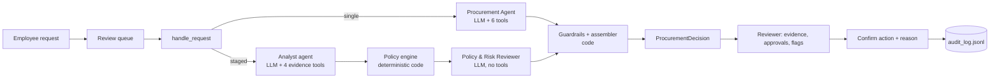

# AI Procurement Request Copilot (FDE Assessment 3)

## 1. What it does

A reviewer opens a software purchase request; the copilot gathers evidence (budget, existing catalog, vendor registry and vendor-risk service, policy) and recommends the next action with the approvals required, risk flags, missing information and a cited evidence trail.
Deterministic code computes every threshold, budget check, review date, conflict and Security/Privacy/Legal trigger; the LLM judges overlap with existing tools, reads intent from free text and writes the recommendation.
A human confirms every action (with a reason when overriding the copilot), and each decision is written to an audit log. Nothing is ever approved or purchased automatically.

## 2. Setup and run

Requires Python 3.11 or 3.12 (tested on 3.12.15, macOS).

```bash
python -m venv .venv
source .venv/bin/activate            # Windows: .\.venv\Scripts\Activate.ps1
python -m pip install -r requirements.txt
cp .env.example .env                 # Windows: Copy-Item .env.example .env ; then add GEMINI_API_KEY (or LLM_PROVIDER=groq + GROQ_API_KEY)
python verify_setup.py               # pre-flight: PRE-FLIGHT PASSED
python run_local.py                  # ONE command: mock vendor-risk API :8001 + reviewer UI (Streamlit) http://127.0.0.1:8501
```

Without an API key the app still works: every request gets the rule-based result with an "AI analysis unavailable" banner.

Other commands:

```bash
python -m unittest discover -s tests -v          # unit tests (no network)
python scripts/smoke_llm.py                      # provider/model check + forced tool-call round trip
python scripts/run_one.py REQ-1008 --arch single # one request: decision, raw proposal, guardrail events
python evals/run_all.py --trials 1               # public runner + 23 golden cases, both architectures + rules-only
python evals/run_all.py --no-llm                 # rules-only baseline (no key needed)
```

## 3. Product workflow

```
Employee submits request (form, or data/requests.json)
  -> Reviewer opens it from the queue (status: New / Analysed / Action recorded)
  -> Copilot gathers evidence and runs deterministic checks
  -> Reviewer sees, decision first: banners for anything unverified/conflicting/injected, the recommendation
     and next step, approvals grouped into business approvals and specialist reviews (each with its rule
     and policy section), risk flags by severity, missing / could-not-verify, an evidence table filterable
     by Rule/Tool/AI, and run cost (LLM calls, tool calls, latency)
  -> Reviewer chooses: Send for approvals | Request clarification | Suggest existing tool | Hold for manual review
     The confirmation states the consequence; a reason is required when overriding the copilot
  -> runtime/audit_log.jsonl: time, request, run ID, architecture, copilot decision, action, override, reason
```

The reviewer UI is the Streamlit app from the starter pack (`app.py`), extended to the full workflow. Routing is simulated: actions are recorded in the audit log only. The queue can be searched and filtered by status, each request has a direct link (`http://127.0.0.1:8501/?request=REQ-1007`), the latest analysis of each request survives a restart, and the layout works at phone width.

## 4. Architecture



| | A: single agent | B: staged (2 agents) |
|---|---|---|
| LLM roles | one agent with all 6 tools | Analyst (evidence tools + policy text) → Policy & Risk Reviewer (no tools) |
| Policy engine | a tool the agent calls (code runs it if skipped) | called by code between the stages |
| Handoff | none | `EvidencePack` + the raw tool results + the policy-engine result |
| Idea being tested | simplest design | an independent reviewer that checks the analyst against raw tool results improves grounding and judgement |

Both end in the same code: completeness gate → policy engine → guardrails → `ProcurementDecision` (`src/solution.py::handle_request`). Any LLM failure falls back to the rule-based result with the flag `llm_unavailable`. More detail, including every deviation from the spec: [`docs/architecture.md`](docs/architecture.md).

## 5. Tools and agents

| Tool | Type | What it returns |
|---|---|---|
| `get_request_details` | deterministic | normalised request, requester and reporting line, required-field check, injection scan |
| `check_budget` | deterministic | cost vs the department's available software budget |
| `search_software_catalog` | deterministic | existing licensed products in the same category/vendor/product, purchase history, which raise the overlap flag |
| `get_vendor_status` | deterministic logic over an **external** service (mock vendor-risk API) | registry row + API outcome (ok / not found / unavailable, one retry), review age vs the policy reference date, expiry, conflict, new vendor, legal terms |
| `evaluate_policy_rules` | deterministic, **authoritative** | approvals with reasons, flags, missing information, tier, data classes |
| `lookup_policy_section` | deterministic | exact text of one policy section |

| Decided by | What |
|---|---|
| Code | financial tier, budget, review currency (365 days), registry/API conflict, Security/Privacy/Legal triggers, required fields, injection scan, final merge |
| LLM | does an existing tool already meet the need; data classes implied only by free text (it may add Security/Privacy/Legal with a reason, never remove); recommendation and next-step wording |
| Human | every routing action, approval and exception |

Guardrails (`src/guardrails.py`): code-computed approvals and flags are always kept; LLM-proposed roles other than Security/Privacy/Legal are dropped; LLM evidence is kept only if its source tool ran, every number, date and ID in it appears in the tool results, and it does not contradict the code's budget check; wording that claims approval or purchase is replaced by a template; `human_review_required` is always true.

Prompt injection: request text, vendor notes and API text reach the LLM only inside tool results marked as untrusted data, a deterministic scanner flags embedded instructions independently of the LLM, and the UI renders all business text as plain text (Markdown-escaped, never HTML; tested with link, image, formula and `` payloads).

## 6. Assumptions

1. **Annual amount** = `annual_cost_usd` as given. One-time costs are treated as the annual amount.
2. **`requested_integrations: []` means "none"**. `null` or an absent key means missing.
3. **Missing data access**: `data_access_level` of `null`, `""` or `"unknown"` counts as missing.
4. **New vendor** = registry `procurement_status == "New"`, or a vendor absent from the registry.
5. **Standard legal terms** = registry `legal_terms_status == "Approved"`. Anything else (Draft, Unknown, blank, not registered) triggers Legal.
6. **Review currency**: a security review is current if `0 ≤ (reference_date − review_date) ≤ 365 days`. The reference date (2026-09-30) is parsed from `data/procurement_policy.md`; the machine clock is never used.
7. **Conflict**: the registry and the API disagree when one says approved and the other does not (expired, not_completed, pending), or when both say approved with different review dates. A conflict is surfaced and routed to Security; neither source wins silently.
8. **Cross-region**: vendor stores data outside the region **and** the request involves PII or confidential documents → material cross-region issue → Privacy and Legal.
9. **Unknown data residency**: vendor-risk API unavailable and the request involves PII or confidential documents → treated as possibly out of region → Privacy.
10. **SSO is not a PII integration.** HR/HRIS/payroll → employee PII; CRM/helpdesk → customer PII; Git/repositories → source code; production/cloud/infrastructure → production access.
11. **Overlap flag**: raised when a catalog product has the same category or an identical product name. Whether it actually *meets the need* is the AI's judgement and drives "use existing tool". Same-vendor-only matches are evidence, not a flag.
12. **Cost missing**: the tier cannot be determined, so the only required approval is Procurement (triage owner) until cost is provided.
13. **Vendor-risk API unavailable, registry review current, data not sensitive**: flag `vendor_risk_unavailable` but do not add Security (the gap is not material). Otherwise an unavailable API adds Security.
14. **Department Head** is shown as a role; the named person is a hint only (the Director of the requester's department, else the nearest Director/VP up the reporting line). Sales and Customer Success report to the Go To Market Director, who has no budget row.

## 7. Evaluation

**Method.** Two harnesses, one command (`python evals/run_all.py --trials 1`; details in [`evals/README.md`](evals/README.md)):

- **Public runner**: the starter pack's 6 cases and minimum checks, unchanged except that it now starts the mock API itself.
- **Golden evaluation**: 23 hand-labelled cases in [`evals/golden_cases.json`](evals/golden_cases.json):
  - the 10 official requests,
  - 11 eval-only fixtures (threshold boundaries, vendor-name casing, an unregistered vendor, injection in the product name and in vendor-API notes, an HR integration, an unknown requester, PII implied only by text),
  - 2 fault injections (vendor-risk API down, LLM unavailable).
- **Scoring**: exact sets, so over-escalation fails too. A case passes only if approvals, flags, missing information, decision and safety are all right.
- **Raw-agent metrics** score the agent's proposal before guardrails, and the trace counts every correction code made.
- **Baseline**: a rules-only column, so the table shows what the LLM adds. G-08 and G-23 are cases rules cannot pass by design.
- **Manual review**: 6 runs per architecture ([`evals/results/manual_review.md`](evals/results/manual_review.md); AI-assisted pre-fill, pending human confirmation).

**Results** (run 2: gemini-3.5-flash-lite, 1 trial, temperature 0; copied from [`evals/results/summary.md`](evals/results/summary.md), which also has the per-case matrix and every failure with its reason):

| Metric | Single (A) | Staged (B) | Rules only |
|---|---:|---:|---:|
| Golden cases passed (final output) | 22/23 | 20/23 | 21/23 |
| Cases only the AI can get right (G-08, G-23) | 1/2 | 0/2 | 0/2 |
| Raw agent decision accuracy | 22/22 | 19/22 | n/a |
| Raw agent approvals exact | 21/22 | 20/22 | n/a |
| Raw agent flags exact | 19/22 | 20/22 | n/a |
| Code corrections per run (approvals + flags restored) | 0.00 | 0.00 | n/a |
| Ungrounded evidence items removed (total) | 3 | 0 | n/a |
| LLM-proposed roles dropped (total) | 0 | 0 | n/a |
| Specialist reviews added by the LLM (total) | 2 | 2 | n/a |
| Evidence tools filled by the gate (total) | 0 | 0 | n/a |
| Injection cases passed (3 per trial) | 3/3 | 3/3 | 3/3 |
| Fault cases passed (2 per trial) | 2/2 | 2/2 | 2/2 |
| Avg active latency (ms) | 6720 | 9997 | 54 |
| Avg total latency incl. rate-limit waits (ms) | 18521 | 30497 | 54 |
| Avg LLM calls / run | 3.00 | 5.00 | 0.00 |
| Avg tool calls / run | 5.35 | 7.04 | 5.00 |
| Avg tokens / run | 10053 | 15148 | 0 |
| Decision consistency across trials | n/a (1 trial) | n/a (1 trial) | n/a (1 trial) |
| Public runner minimum checks | 6/6 | 6/6 | 6/6 |
| Runs excluded (provider quota exhausted) | 0 | 0 | 0 |

Run 2 was completed in two sessions because the free tier allows 500 requests per day per project. Both sessions used the same code, model and settings: `--resume` re-ran only the runs that the quota had stopped. Run 1, before change C1, is kept in [`evals/results/history/`](evals/results/history/run1_summary.md): single 18/23, staged 16/23, rules only 21/23.

**Reproduce:**

```bash
python evals/run_all.py --no-llm             # rules-only column, no key, about 2 s
python evals/run_all.py --trials 1 --fresh   # all columns (run 2 golden cases: 22 x 3.00 + 22 x 5.00 = 176 LLM calls, plus the public runner)
python evals/run_all.py --trials 1 --resume  # continue after a quota stop
```

## 8. Architecture comparison

| | Single (A) | Staged (B) |
|---|---|---|
| Golden cases passed | 22/23 | 20/23 |
| Cases only the AI can get right (G-08 existing tool, G-23 PII in text) | 1/2 | 0/2 |
| Avg LLM calls / active latency | 3.00 / 6,720 ms | 5.00 / 9,997 ms |
| Ungrounded evidence items removed by code | 3 | 0 |
| Policy failures found manually (6 runs) | 1 (a correct number given the wrong meaning: "$7,000 remaining… insufficient") | 0 |
| Characteristic failure | misses Security for PII implied only by text (G-23) | over-escalates Privacy when the vendor processes personal data but the request does not (G-12); missed the existing-tool case (G-08) |

Staged's independent reviewer produced cleaner evidence, which was its hypothesis. It made worse decisions and cost 67% more LLM calls. Both architectures inherit identical safety from code: injection 3/3, faults 2/2, and no approval or flag ever needed restoring. The largest single improvement came from a code change, not from the architecture. C1 stopped rule R12 from overriding a correct agent decision on the strength of an inconsistent overlap entry; see [`docs/architecture.md`](docs/architecture.md).

## 9. Ship decision

**Ship the single agent (A).** It has the better pass rate, the only win on the AI-only cases, and 40% fewer LLM calls. The reasoning is in [`docs/DECISION_MEMO.md`](docs/DECISION_MEMO.md) (488 words). Two things to do before production: extend the budget-status cross-check added after the manual review (C2: AI evidence claiming a shortfall the budget check did not find is removed) to vendor and data-class claims, and add a deterministic PII keyword scan of justifications for G-23-type requests.

## 10. Known limitations

- **Open questions for the client** (we chose the conservative option for each):
  - Should a budget shortfall block routing, or travel alongside it as an exception? We route with Finance added.
  - Is SSO considered employee-PII processing by Privacy? We assumed not.
  - Who is the Department Head for departments without a Director? We show the nearest Director/VP as a hint.
  - Can AI tools approved for "limited use" be expanded to new data classes without a new assessment? We assumed no (policy §8).
- **Free-tier LLM limits.** The spec's default models are retired. On the free tier `gemini-3.5-flash` allows 20 requests/day and `gemini-3.5-flash-lite` (used for the evaluation) 500/day per project, so one full trial fits (run 2 used 176 LLM calls for the golden cases alone, plus the public runner) but multiple trials do not; decision consistency across trials was not measured. Groq's free tier (8,000 tokens/minute) makes each run wait for its token budget. Latency is reported both with and without rate-limit waits.
- **Small evaluation set.** 23 hand-labelled cases (10 official, 11 fixtures, 2 fault injections) and a limited number of trials; differences of one or two cases between architectures are within run-to-run noise.
- **No real integrations.** The vendor-risk service is the provided mock; approvals, notifications and purchasing are simulated through the audit log; there is no authentication or multi-user state.
- **Model judgement is imperfect.** The agent sometimes over-escalates (adds a review the policy does not require) or misses a data class implied only by free text. Code guarantees nothing is removed, but over-escalation still reaches the reviewer.
